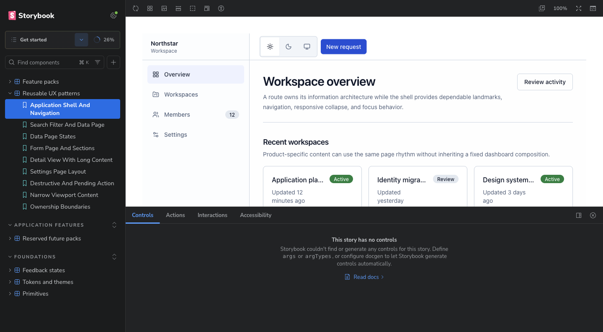
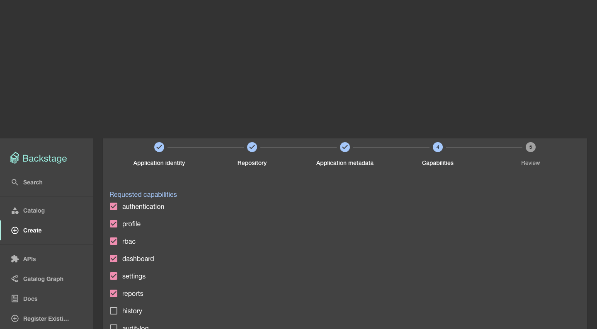
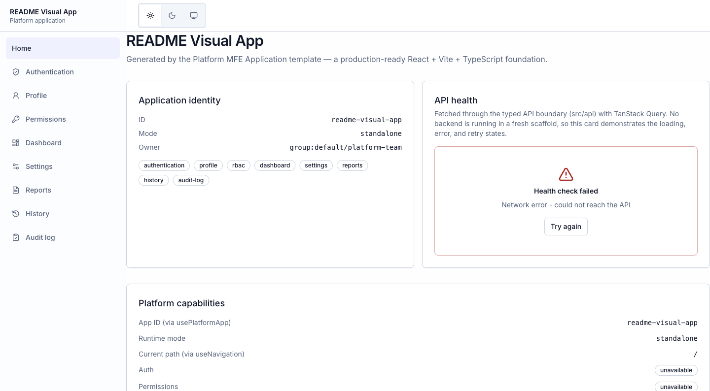
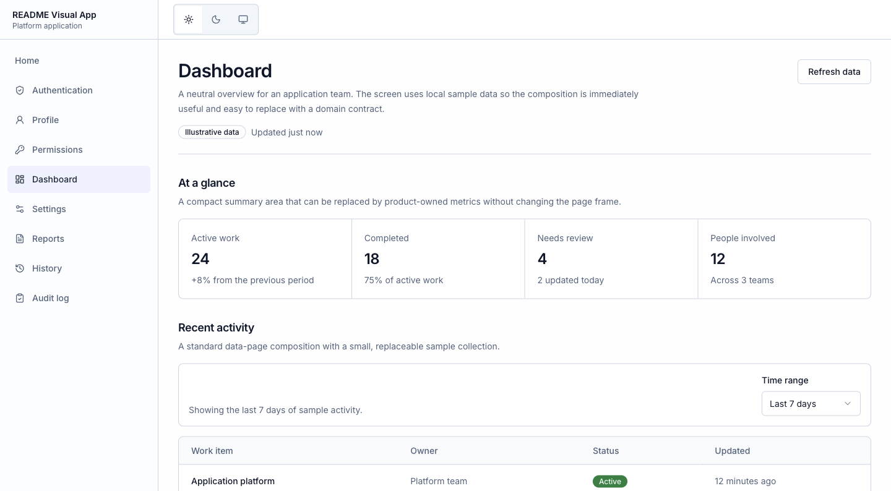
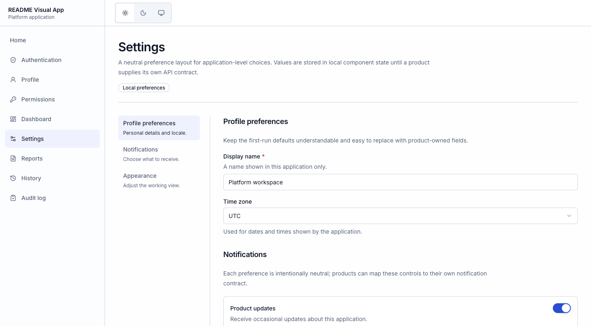

# Frontend Standard Platform

## ภาษาไทย

### ภาพรวม

Repository นี้คือ **Backstage control plane และ App Factory** สำหรับมาตรฐาน
Frontend ของทีม โดยช่วยให้ทีมสร้าง React application ที่มีโครงสร้างและ
ประสบการณ์พื้นฐานสอดคล้องกันได้เร็วขึ้น

ส่วนประกอบหลักมีดังนี้:

| ส่วนประกอบ              | หน้าที่                                                                                |
| ----------------------- | -------------------------------------------------------------------------------------- |
| @platform/ui            | Design tokens, accessible UI primitives, feedback states และ Design System Portal      |
| @platform/sdk           | สัญญากลางของ app identity, runtime, navigation, authentication, permissions และ tenant |
| Backstage control plane | Catalog, การเข้าสู่ระบบของผู้ดูแล และหน้า App Factory                                  |
| Generated application   | Repository ของ product ที่ทีมจะนำไปพัฒนา business domain ต่อ                           |

Control plane นี้ไม่ใช่ runtime ของ product application และไม่ได้สร้าง backend
ของ product ให้โดยอัตโนมัติ แอปที่สร้างขึ้นจะเป็นเจ้าของ domain, API, workflow
และกฎธุรกิจของตัวเอง ส่วน platform จะดูแล shared foundation และ contract กลาง

มาตรฐาน UX/UI ในที่นี้หมายถึง shell, semantic theme/token, accessible
primitives, feedback states และพฤติกรรมทั่วไปของ Feature Pack ที่ใช้ร่วมกันได้
ไม่ใช่การบังคับ information architecture, copy, workflow หรือ visual brand ของ
ทุก product — domain-specific UX ยังปรับต่างกันได้ภายใต้ foundation เดียวกัน

ภาพจาก local runtime จริงของ repository แสดงให้เห็น shared visual language:



_Design System Portal: catalog ของ application shell, navigation และ reusable UX patterns ที่มาจาก `@platform/ui` จริง_

### เริ่มใช้งานอย่างเร็ว

#### สิ่งที่ต้องมี

- Node.js 22 เป็น baseline ที่ใช้ใน CI (Node.js 24 ก็รองรับใน root repository)
- Generated application ต้องใช้ Node.js >=22.12
- Docker ไม่จำเป็นสำหรับการเริ่มต้นแบบ SQLite ในหน่วยความจำ แต่ต้องใช้เมื่อ
  ต้องการ PostgreSQL ผ่าน Docker Compose
- GitHub token ใช้เมื่อ App Factory ต้องตรวจสอบ สร้าง และ push repository
- บน Windows/WSL ให้ใช้ Node, Yarn และ node_modules อยู่ใน environment เดียวกัน

#### ติดตั้ง

```bash
git clone https://github.com/phcaradanai/platform-control-plane.git
cd platform-control-plane
node .yarn/releases/yarn-4.13.0.cjs install --immutable
```

Repository นี้ vendored Yarn 4.13.0 ไว้แล้ว จึงไม่ต้องติดตั้ง global Yarn
หรือพึ่ง Corepack เพื่อให้ได้เวอร์ชันที่ตรงกัน

#### รัน Backstage

ใช้สอง terminal แยกกัน วิธีนี้เป็น workflow ที่แนะนำบน Windows และใช้ได้บน
macOS, Linux และ WSL เช่นกัน

Terminal 1 — backend:

```bash
# ถ้าจะใช้ App Factory ให้ใส่ token จริง
# ถ้าแค่เปิดดู Catalog/หน้าเว็บ ใช้ค่า placeholder ที่ไม่ใช่ secret ได้
export GITHUB_TOKEN='<github-token-or-local-placeholder>'
node .yarn/releases/yarn-4.13.0.cjs dev:backend
```

บน PowerShell ใช้:

```powershell
$env:GITHUB_TOKEN = '<github-token-or-local-placeholder>'
node .yarn/releases/yarn-4.13.0.cjs dev:backend
```

Terminal 2 — frontend:

```bash
node .yarn/releases/yarn-4.13.0.cjs dev:app
```

เปิดใช้งานที่:

- Frontend: <http://localhost:3000>
- Backend: <http://localhost:7007>
- Readiness: <http://localhost:7007/.backstage/health/v1/readiness>

เมื่อ readiness ได้ 200 แล้ว ให้เปิด frontend เลือก **Enter** เพื่อใช้ Guest
ใน local development จากนั้นลองเข้า **Catalog** และ **Create**

> Backstage จะไม่โหลด .env อัตโนมัติสำหรับ workflow แบบสอง process ให้
> export ตัวแปรใน terminal ที่ใช้รัน backend เอง และห้าม commit .env
> หรือใส่ secret ลงใน log

#### เปิด Design System Portal

เปิด terminal ที่สามแล้วรัน:

```bash
node .yarn/releases/yarn-4.13.0.cjs dev:portal
```

เปิด <http://127.0.0.1:6006> เพื่อดู source-backed component และ UX pattern
ที่ใช้เป็น review surface ของ @platform/ui

### สร้าง application ด้วย App Factory

เมื่อ Backstage ทำงานแล้ว:

1. เปิด <http://localhost:3000> แล้วเลือก **Enter**
2. ไปที่ **Create**
3. เลือก **Platform MFE Application**
4. กรอกข้อมูล application, owner, GitHub repository, lifecycle, runtime mode
   และ capabilities
5. Submit แล้วติดตาม task output ไปยัง GitHub repository และ Catalog entity

หน้าจอจริงของขั้นตอน **Capabilities** จะแสดงทั้ง Feature Pack ที่สร้าง route
และ screen ให้ generated app กับ capability ที่เป็นเพียง foundation/metadata:



_App Factory: ตัวอย่างการเลือก `authentication`, `profile`, `rbac`, `dashboard`, `settings` และ `reports` ก่อน review — ภาพนี้ยังไม่ได้ submit หรือสร้าง repository ใด ๆ_

ก่อน submit ต้องตรวจสอบว่า:

- backend terminal มี GITHUB_TOKEN ที่มีสิทธิ์สร้างและ push repository เป้าหมาย
- token มีสิทธิ์ที่จำเป็นสำหรับการส่ง generated GitHub Actions workflow
- owner เป็น group ที่มีอยู่ใน Catalog (local development มักใช้
  group:default/platform-team)
- repoUrl ใช้ host github.com

ขั้นตอนภายในใช้ Backstage built-in actions:

```text
fetch:template -> fs:delete -> publish:github -> catalog:register
```

ผลลัพธ์คือ repository ใหม่ที่มี default branch เป็น main และมี
catalog-info.yaml สำหรับลงทะเบียนกลับเข้า Backstage

#### Runtime mode ที่ควรรู้ก่อนสร้าง

| Mode               | เมื่อไม่มี host             | เมื่อมี compatible host            |
| ------------------ | --------------------------- | ---------------------------------- |
| standalone         | ทำงานแบบ standalone         | ยังคง standalone และ ignore host   |
| platform-mfe       | แสดง Platform host required | ทำงานแบบ hosted ผ่าน host adapters |
| standalone-and-mfe | ทำงานแบบ standalone         | ทำงานแบบ hosted เมื่อมี host       |

ค่าเริ่มต้นของ form คือ platform-mfe แต่ repository นี้ยังไม่มี Super App
หรือ production Module Federation host ดังนั้นถ้าต้องการ clone แล้วรันในเครื่อง
ได้ทันที ให้เลือก standalone หรือ standalone-and-mfe

ทุก generated application จะบันทึก:

```json
"runtime": { "type": "module-federation", "status": "not-configured" }
```

ฟิลด์นี้เป็น metadata ของ boundary ในอนาคต ไม่ได้หมายความว่า Module Federation
ถูกติดตั้งหรือเชื่อมต่อแล้ว

### หลังสร้าง application แล้ว

เข้าไปที่ generated repository แล้วรัน:

```bash
npm ci
npm run dev
npm run typecheck
npm run lint
npm test
npm run build
npm run test:e2e
```

Generated application ใช้ npm และมี package-lock.json ติดมาด้วย ควรใช้
Node.js >=22.12 และรักษา package.json กับ lockfile ให้ตรงกัน

สิ่งที่ได้โดยสรุป:

- React + Vite + strict TypeScript
- TanStack Router, Query, Table และ Virtual
- @platform/ui และ @platform/sdk แบบ vendored
- typed API client พร้อม timeout, cancellation และ normalized ApiError
- route, layout, form/table examples และ loading/empty/error states
- Vitest/Testing Library และ Playwright
- GitHub Actions workflow สำหรับ lint, typecheck, unit test, build และ E2E

รายละเอียด output ดูได้ที่ [App Factory guide](docs/app-template.md)

ตัวอย่าง generated output ที่เปิดจาก skeleton จริงจะมี shell และ navigation
มาตรฐานให้เริ่มพัฒนาได้ทันที:



_Generated app แบบ `standalone`: shell, theme toggle, app identity, capability metadata และ generic API feedback state; ยังไม่มี product backend หรือ host runtime_

### ตั้งค่า API และ Authentication

ใน generated app ให้ copy .env.example เป็น .env.local:

```bash
cp .env.example .env.local
```

ตัวแปรสำคัญ:

```dotenv
VITE_API_BASE_URL=http://localhost:8080/api
VITE_AUTH_ISSUER_URL=
VITE_AUTH_CLIENT_ID=
VITE_AUTH_REDIRECT_URI=http://localhost:5173/authentication
VITE_AUTH_POST_LOGOUT_REDIRECT_URI=http://localhost:5173/authentication
VITE_AUTH_SCOPE=openid profile email
VITE_AUTH_AUDIENCE=
```

กติกา OIDC ที่สำคัญ:

- ต้องกำหนดทั้ง VITE_AUTH_ISSUER_URL และ VITE_AUTH_CLIENT_ID
- ใช้ Authorization Code + PKCE สำหรับ public browser client
- ห้ามใส่ client secret ใน VITE\_\* หรือในไฟล์ที่ถูกส่งไป browser
- ลงทะเบียน callback และ post-logout callback กับ provider ให้ตรงกับ
  origin/path ของแอป
- discovery document ของ issuer ต้องชี้ไปยัง authorization, token และ JWKS
  endpoint ที่ใช้งานได้ และ issuer ต้องตรงกับค่าที่ตั้งไว้
- VITE_AUTH_AUDIENCE ใช้เมื่อ provider/API ต้องการ audience เฉพาะ

เมื่อมี host-provided AuthAdapter runtime จะเลือก host adapter ก่อนสร้าง
local OIDC adapter หากไม่มี host adapter แต่มี OIDC config จะใช้ adapter ที่
generated app สร้างขึ้นเอง หากไม่มีทั้งสองอย่าง สถานะ authentication จะเป็น
unavailable โดยตั้งใจ

Local adapter:

- เก็บ access token, refresh token และ identity token ไว้ใน memory
- เก็บเฉพาะ transaction อายุสั้นของ OIDC/PKCE ไว้ใน sessionStorage
- validate callback state และ transaction age
- validate ลายเซ็น ID token กับ discovery JWKS รวม issuer, audience/client,
  azp เมื่อจำเป็น, nonce และ time claims
- มี timeout/cancellation สำหรับงานกับ provider และการขอ token
- ส่ง bearer token ผ่าน src/api/client.ts
- ทำให้ local session หมดอายุเมื่อ API ตอบ 401
- รักษา nested pathname/query/hash ที่ปลอดภัยเมื่อ restore session

ทั้งหมดนี้เป็น frontend boundary ไม่ใช่ security authority ฝั่ง server
Backend/API จริงยังต้อง validate bearer token และ enforce authorization เอง
การ sign in เข้า Backstage เป็น operator identity คนละส่วนกับ end-user ของ
generated application

### เลือก Capabilities ให้ถูกความหมาย

| กลุ่ม                       | รายการ                                                                          | สิ่งที่เกิดขึ้น                                                                 |
| --------------------------- | ------------------------------------------------------------------------------- | ------------------------------------------------------------------------------- |
| Frontend Feature Packs      | authentication, profile, rbac, dashboard, settings, reports, history, audit-log | เพิ่ม route, navigation, screen, interaction และ focused tests ตามที่เลือก      |
| Infrastructure capabilities | notifications, i18n, observability                                              | compose module เข้า extension point ของแอป                                      |
| Always-on foundation        | theme                                                                           | มีอยู่ในทุก generated app ผ่าน @platform/ui; การเลือก theme แค่บันทึก request   |
| Recorded-only               | tenant, desktop-ready, mobile-ready                                             | บันทึกใน platform-app.json แต่ไม่สร้าง page, provider, data source หรือ backend |

ข้อควรจำ:

- profile และ rbac ต้องใช้ authentication
- audit-log ต้องใช้ authentication และ rbac
- Reports, History และ Audit Log มี typed frontend/data-source contract แต่
  ไม่ได้สร้าง data service, persistence, export endpoint หรือ authorization
- ทุก selection ถูกบันทึกใน platform-app.json แต่ไม่ได้แปลว่ามี production
  provider หรือ backend พร้อมใช้งาน

ดูรายละเอียด composition ปัจจุบันที่ [capabilities](docs/capabilities.md) และ
[feature packs](docs/feature-packs.md)

ตัวอย่างหน้าจอ Feature Pack ที่ generated app ได้จากการเลือก capability:



_Dashboard: summary, data-page rhythm, range selector และ sample table เป็น generic behavior ที่ product นำไปต่อกับ domain data ได้_



_Settings: settings navigation, form sections, switches และ local-save interaction ใช้ foundation เดียวกัน แต่ field และ policy ของ product เปลี่ยนได้_

### จุดเริ่มต้นของการพัฒนา business domain

โดยทั่วไปให้เพิ่มงานของ product ที่:

- src/features/ สำหรับ domain modules
- src/routes/ สำหรับ route ของ product
- src/api/ สำหรับ typed endpoint client
- src/components/ สำหรับ component ที่เป็นของ product

ใช้ shell, @platform/ui, theme tokens และ feedback patterns ที่ generated app
มีอยู่แล้ว อย่าสร้าง UI wrapper หรือ token layer ซ้ำ และให้ทุก network call
ผ่าน src/api/client.ts แทนการเรียก fetch ใน component โดยตรง

Product/backend เป็นเจ้าของ:

- domain rules และ workflow
- API implementation และ persistence
- authentication/authorization authority
- tenant isolation, audit integrity และ compliance

อ่านต่อที่ [Business-domain development](docs/business-domain-development.md)
และ [Backend integration boundaries](docs/backend-integration.md)

### ขอบเขตที่ยังไม่ควรเข้าใจเกินจริง

ปัจจุบัน platform มี frontend foundation, SDK contract, App Factory,
generated CI และ generated public OIDC adapter เมื่อมีการตั้งค่า แต่ยังไม่มี:

- Super App หรือ production Module Federation host/runtime
- platform-owned identity provider operation
- generated backend หรือ business API
- tenant service, persistence, report/history/audit data service
- deployment infrastructure หรือ production authorization authority

ดังนั้น runtime.status: not-configured และ capability ที่เป็น
recorded-only ต้องถือเป็นข้อจำกัดจริง ไม่ใช่ feature ที่เปิดใช้งานแล้ว

### ตรวจสอบ platform และแก้ปัญหาเบื้องต้น

คำสั่งตรวจสอบหลักให้รันจาก root:

```bash
node .yarn/releases/yarn-4.13.0.cjs lint:all
node .yarn/releases/yarn-4.13.0.cjs tsc
node .yarn/releases/yarn-4.13.0.cjs test:all
node .yarn/releases/yarn-4.13.0.cjs build:all
node .yarn/releases/yarn-4.13.0.cjs build:portal
docker compose config --quiet
node .yarn/releases/yarn-4.13.0.cjs test:e2e:smoke
```

ปัญหาที่พบบ่อย:

- Backend readiness เป็น 503: รอให้ startup เสร็จ หรือดู backend terminal
  เรื่อง port, environment และ PostgreSQL
- Platform host required: สร้าง app ด้วย platform-mfe แต่ยังไม่มี host ให้
  เปลี่ยนเป็น standalone หรือ standalone-and-mfe สำหรับ local development
- App Factory publish ไม่ผ่าน: ตรวจ GITHUB_TOKEN ใน terminal ที่รัน backend
  และสิทธิ์สร้าง/push repository กับ workflow
- Generated app npm ci ไม่ผ่าน: ใช้ Node.js >=22.12 และอย่าแก้
  package-lock.json แยกจาก package.json
- Authentication เป็น unavailable: ตรวจ issuer + client ID, callback ที่
  provider, discovery/JWKS, CORS และ clock ของเครื่อง
- API health error: VITE_API_BASE_URL เป็นเพียง boundary ตัวอย่างและ
  repository นี้ไม่ได้สร้าง backend ให้

ดูรายการแก้ปัญหาเต็มได้ที่ [Troubleshooting](docs/troubleshooting.md)

### เอกสารแนะนำตามลำดับ

1. [Platform overview](docs/platform-overview.md)
2. [Architecture](docs/architecture.md)
3. [Getting started](docs/getting-started.md)
4. [App Factory guide](docs/app-template.md)
5. [Capabilities](docs/capabilities.md)
6. [Business-domain development](docs/business-domain-development.md)
7. [Backend integration boundaries](docs/backend-integration.md)
8. [Design System Portal](docs/design-system-portal.md)
9. [Troubleshooting](docs/troubleshooting.md)
10. [Current platform status](docs/status.md)

เอกสารทั้งหมดอยู่ที่ [docs/README.md](docs/README.md)

---

## English

### Overview

This repository is the **Backstage control plane and App Factory** for the
frontend standard platform. It gives product teams a repeatable starting point
for React applications while keeping business-domain ownership in the generated
application.

| Area                    | Responsibility                                                                                |
| ----------------------- | --------------------------------------------------------------------------------------------- |
| @platform/ui            | Semantic theme tokens, accessible UI primitives, feedback states and the Design System Portal |
| @platform/sdk           | Application identity, runtime, navigation, authentication, permissions and tenant contracts   |
| Backstage control plane | Catalog, operator sign-in and the App Factory                                                 |
| Generated application   | Product-owned domain code, API integration, workflows and business rules                      |

The control plane is not the product runtime and does not generate a product
backend. Generated applications consume the shared foundation and own their
domain implementation.

### Quick start

Prerequisites:

- Node.js 22 is the CI baseline; Node.js 24 is also allowed by the root repo.
- Generated applications require Node.js >=22.12.
- Docker is optional for the default in-memory SQLite setup and required only
  for the local PostgreSQL option.
- A GitHub token is needed when App Factory must validate, create and push a
  repository.

Install the pinned Yarn release:

```bash
git clone https://github.com/phcaradanai/platform-control-plane.git
cd platform-control-plane
node .yarn/releases/yarn-4.13.0.cjs install --immutable
```

Run the backend and frontend in separate terminals:

```bash
# Terminal 1
export GITHUB_TOKEN='<github-token-or-local-placeholder>'
node .yarn/releases/yarn-4.13.0.cjs dev:backend

# Terminal 2
node .yarn/releases/yarn-4.13.0.cjs dev:app
```

On PowerShell, use $env:GITHUB_TOKEN = '<github-token-or-local-placeholder>' instead of
export. A real token is required for App Factory repository checks and
publishing. The two-process workflow does not automatically load .env; export
variables in the process that starts the backend and never commit .env.

If you are only inspecting the local UI, use a non-secret placeholder such as
`local-only-placeholder`; App Factory validation and publishing still require
a real token with the necessary GitHub permissions.

Open:

- Frontend: <http://localhost:3000>
- Backend: <http://localhost:7007>
- Readiness: <http://localhost:7007/.backstage/health/v1/readiness>

Choose **Enter** for local Guest auth, then verify **Catalog** and **Create**.
For the shared UX review surface, run:

```bash
node .yarn/releases/yarn-4.13.0.cjs dev:portal
```

Then open <http://127.0.0.1:6006>.

### Create an application with App Factory

In Backstage, choose **Create** → **Platform MFE Application**, complete the
form, submit it, and follow the task output to the GitHub repository and Catalog
entity. The template uses:

```text
fetch:template -> fs:delete -> publish:github -> catalog:register
```

The backend token must be able to create/push the target repository and include
the generated GitHub Actions workflow. The owner must be a Catalog group; local
development normally uses group:default/platform-team. The GitHub host is
github.com, and the generated default branch is main.

The form supports three runtime modes:

| Mode               | Without a host               | With a compatible host             |
| ------------------ | ---------------------------- | ---------------------------------- |
| standalone         | Runs standalone              | Still ignores the host             |
| platform-mfe       | Shows Platform host required | Runs hosted through host adapters  |
| standalone-and-mfe | Runs standalone              | Runs hosted when a host is present |

The form defaults to platform-mfe, but this repository does not ship a
production Super App or Module Federation host. Choose standalone or
standalone-and-mfe for a generated app that should run locally without a host.

The form's capability step is a real composition boundary: selected Feature
Packs add generated routes, navigation, screens, interactions and focused
tests. Recorded-only identifiers remain metadata and do not imply shipped
runtime behavior.

Every generated app records:

```json
"runtime": { "type": "module-federation", "status": "not-configured" }
```

This is metadata for a future runtime boundary; it does not install or wire
Module Federation.

### Run and verify a generated application

From the generated repository:

```bash
npm ci
npm run dev
npm run typecheck
npm run lint
npm test
npm run build
npm run test:e2e
```

The generated project uses npm and includes a committed package-lock.json.
Use Node.js >=22.12 and keep the manifest and lockfile synchronized.

It includes a React/Vite/strict-TypeScript foundation, TanStack tooling,
vendored @platform/ui and @platform/sdk, a typed API client with timeout
and cancellation, standard feedback states, test suites and GitHub Actions CI.
See the [App Factory guide](docs/app-template.md) for the generated layout.

The source-backed local capture in the Thai section shows the generated shell,
navigation and representative Dashboard/Settings screens. Those screens prove
the shared foundation and generic feature behavior; product/domain UX can still
use different routes, copy, data and workflows within the same foundation.

### Configure API and authentication

Copy .env.example to .env.local in the generated app:

```bash
cp .env.example .env.local
```

Use VITE_API_BASE_URL for the backend API. To enable the generated public
OIDC client, set both VITE_AUTH_ISSUER_URL and VITE_AUTH_CLIENT_ID; the
redirect and logout callback defaults use /authentication. Optional values
include VITE_AUTH_SCOPE and VITE_AUTH_AUDIENCE.

The browser client uses Authorization Code + PKCE and accepts no client
secret. It keeps access, refresh and identity tokens in memory, stores only
the short-lived transaction in sessionStorage, validates callback state and
transaction age, verifies ID tokens against discovery JWKS, and bounds provider
operations. The API client obtains a bearer token, propagates timeout and
cancellation, and expires the local session after a backend 401.

A host-provided AuthAdapter is selected before local OIDC construction. With
no host adapter, configured public OIDC settings provide the local fallback.
With neither source, authentication is intentionally unavailable. The real
API/backend must validate the bearer token and enforce authorization; Backstage
operator sign-in is separate from generated-app end-user authentication.

### Capabilities

- **Frontend Feature Packs:** authentication, profile, rbac, dashboard,
  settings, reports, history and audit-log. Selected packs add routes,
  navigation, screens, interactions and focused tests.
- **Infrastructure capabilities:** notifications, i18n and observability
  compose modules into their extension points.
- **Always-on foundation:** theme is provided by @platform/ui in every
  generated app. Selecting it only records the request.
- **Recorded-only identifiers:** tenant, desktop-ready and mobile-ready are
  written to platform-app.json but do not create pages, providers, data
  sources or backends.

profile and rbac depend on authentication; audit-log depends on both
authentication and rbac. Reports, History and Audit Log provide replaceable
typed frontend/data-source contracts, not production data services or
authorization. See [capabilities](docs/capabilities.md) and
[feature packs](docs/feature-packs.md).

### Where product development begins

Add product-owned code under src/features/, src/routes/, src/api/ and product
components. Extend the generated shell and use @platform/ui, semantic theme
tokens and the existing feedback patterns. Route all network requests through
src/api/client.ts; components should not call fetch directly.

The product/backend owns domain rules, API implementation, persistence,
authentication and authorization authority, tenant isolation, audit integrity
and compliance. See [Business-domain development](docs/business-domain-development.md)
and [Backend integration boundaries](docs/backend-integration.md).

### Current limitations

The platform currently provides the frontend foundation, SDK contracts, App
Factory, generated CI and a generated public OIDC adapter when configured. It
does not provide a production Super App or Module Federation host, a
platform-owned identity provider, a generated backend, tenant services,
report/history/audit persistence, deployment infrastructure or production
authorization authority.

Treat runtime.status: not-configured and recorded-only capabilities as real
boundaries, not as shipped runtime features.

### Validation and troubleshooting

Platform checks:

```bash
node .yarn/releases/yarn-4.13.0.cjs lint:all
node .yarn/releases/yarn-4.13.0.cjs tsc
node .yarn/releases/yarn-4.13.0.cjs test:all
node .yarn/releases/yarn-4.13.0.cjs build:all
node .yarn/releases/yarn-4.13.0.cjs build:portal
docker compose config --quiet
node .yarn/releases/yarn-4.13.0.cjs test:e2e:smoke
```

Common fixes:

- Readiness 503: wait for startup or inspect the backend terminal for ports,
  environment variables or PostgreSQL errors.
- Platform host required: use standalone or standalone-and-mfe for local
  development, or provide a compatible host.
- App Factory publish failure: check GITHUB_TOKEN and repository/workflow
  permissions in the backend process.
- Generated npm ci failure: use Node.js >=22.12 and keep the lockfile in sync.
- Authentication unavailable: verify issuer, client ID, callback registration,
  discovery/JWKS, CORS and the local clock.
- API health errors: VITE_API_BASE_URL is an example boundary; no backend is
  generated by this repository.

See [Troubleshooting](docs/troubleshooting.md) for the complete guide.

### Documentation

Start with [Platform overview](docs/platform-overview.md), then read
[Architecture](docs/architecture.md), [Getting started](docs/getting-started.md),
[App Factory guide](docs/app-template.md), [Capabilities](docs/capabilities.md),
[Business-domain development](docs/business-domain-development.md),
[Backend integration boundaries](docs/backend-integration.md),
[Design System Portal](docs/design-system-portal.md),
[Troubleshooting](docs/troubleshooting.md) and
[Current platform status](docs/status.md).

The full documentation index is [docs/README.md](docs/README.md).
